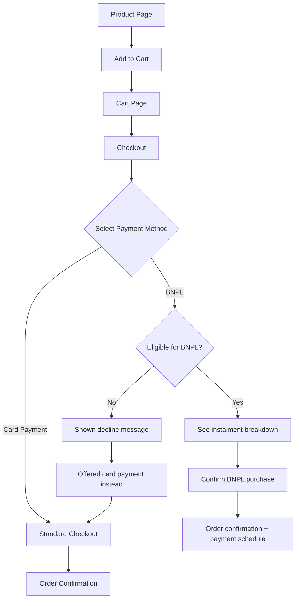

# [PRD] Checkout - Buy Now Pay Later (BNPL) Integration

## POC Map

| Role | Name |
|------|------|
| PM | Kieran |
| Designer | TJ |
| FE | Kyle |
| BE/SA | Chen Wei |
| Data/Algo/AI | - |
| QA | Lisa |
| Stakeholders | Jack (CEO), Finance Team |

### Requirement Ticket (Xingyun)
[BNPL-2024-001]

---

## 1. Overview

### 1.1 Requirement Background, Objective, Benefit

**Background**: Joybuy customers abandon carts at higher rates for orders over £50 compared to competitors. Exit surveys indicate 34% cite "price too high right now" as the reason. Jack requested we investigate BNPL after seeing Klarna integration on Amazon.

**Objective**: Reduce cart abandonment for orders over £50 by integrating a BNPL payment option at checkout.

**Benefit**: Increased conversion rate, higher average order value, competitive parity with Amazon/eBay in the UK market.

### 1.1.1 Success Criteria

Key metrics to measure the success of this feature:

- Cart abandonment rate for orders over £50 — TBC
- Conversion rate at checkout — TBC
- Average order value — TBC
- BNPL adoption rate (% of eligible orders using BNPL) — TBC
- Fallback-to-card rate after BNPL decline — TBC

### 1.2 Use Case

**Primary**: A Joybuy shopper finds a product they want (£60+) but hesitates to pay in full. They see the BNPL option, choose to split into 3 instalments, and complete the purchase.

**Secondary**: A returning customer checks their BNPL payment schedule in order history to manage their upcoming payments.

### 1.3 Competitors Analysis

*To be completed by PM with verified data. Relevant competitors to research: Amazon UK, eBay UK, ASOS, AliExpress.*

### 1.4 User Analysis / Feedback

- Exit survey: 34% of cart abandoners cite price as reason (orders >£50)
- Customer support: ~50 tickets/month asking about payment plans
- User interviews: 8/10 UK shoppers have used BNPL elsewhere

### 1.6 Terminology (optional)

| Term | Definition |
|------|-----------|
| BNPL | Buy Now Pay Later — split payment into instalments |
| Klarna | Third-party BNPL provider |
| FCA | Financial Conduct Authority — UK regulator |

---

## 2. Overall Process

### 2.1 Flow / UML / System Chart

#### User Flow — BNPL at Checkout

### 2.2 Relevant Systems & Domains/Parties

*Involves checkout frontend, order service, payment service, Klarna (external), email service, analytics, and finance for reconciliation. Specific team assignments per POC Map above.*

---

## 3. Functional Requirement

### 3.1 Design

- Product page BNPL badge: [Figma link TBD]
- Checkout BNPL option: [Figma link TBD]
- Confirmation page update: [Figma link TBD]

### 3.2 Requirement List

**Highlights:**
1. Klarna BNPL integration at checkout for orders over £30
2. Instalment breakdown shown before purchase (FCA legal requirement)
3. Graceful degradation when Klarna is unavailable

| Epic/Requirement Module | User Stories / Requirement Details | Mockup | Remark | Priority |
|------------------------|-----------------------------------|--------|--------|----------|
| Product Page BNPL Badge | As a shopper, I want to see BNPL availability on product pages for eligible items (>£30) so I know I can pay in instalments | [Figma] | Show Klarna badge | P0 |
| Checkout — BNPL Option | As a shopper, I want to select BNPL at checkout so I can split my payment | [Figma] | Primary CTA alongside card | P0 |
| Checkout — Instalment Breakdown | As a shopper, I want to see the instalment breakdown before confirming so I understand what I'm committing to | [Figma] | FCA legal requirement | P0 |
| Graceful Degradation | When Klarna is unavailable, hide BNPL option and default to card payment without errors | - | No broken UI | P0 |
| Email — Payment Schedule | As a customer, I want to receive a payment schedule confirmation email after BNPL purchase | - | Use existing email service | P0 |
| Order History — BNPL Status | As a customer, I want to see my BNPL status and payment schedule in order history | [Figma] | - | P0 |
| Analytics — BNPL Tracking | Track BNPL interactions, eligibility, adoption, and fallback rates | - | Set up in Easy Analytics | P0 |

---

## 4. Non-functional Requirement

### 4.1 Multi-language

*Translations required for all supported locales (UK, DE, FR, NL). To be handled by the internal localisation team.*

Strings requiring translation:
- BNPL badge text on product page
- "Pay in 3 instalments" label at checkout
- Instalment breakdown copy
- BNPL decline message
- Payment schedule email content
- Order history BNPL status labels

### 4.2 Data / Event Tracker

*To be set up in Easy Analytics by PM.*

| What to track | When it fires | Why we need it |
|--------------|---------------|----------------|
| BNPL badge seen on product page | Product page loads for an eligible item | Understand BNPL awareness / visibility |
| User selects BNPL at checkout | User clicks the BNPL payment option | Track BNPL interest and adoption |
| BNPL eligibility result | Klarna returns whether user is eligible | Track eligibility / decline rate |
| BNPL purchase completed | Order confirmed with BNPL payment | Track BNPL conversion |
| User falls back to card after BNPL decline | User chooses card payment after being declined for BNPL | Understand fallback behaviour and lost BNPL conversions |

### 4.3 Feature Release Plan

#### V1 Scope

- Klarna BNPL at checkout for UK market
- Product page BNPL badge for eligible items (>£30)
- Instalment breakdown display (FCA compliant)
- Graceful degradation when Klarna is unavailable
- Payment schedule confirmation email
- BNPL status in order history
- All platforms (PC, Mweb, App)

#### Future Iterations

- Add Clearpay as second BNPL option
- BNPL for subscription products
- Personalised BNPL offers based on customer history
- Dedicated BNPL landing page explaining the service
- Expand to DE, FR, NL markets

---

## 5. Relevant User End

### Platform

| Platform | Involved |
|----------|----------|
| APP | Yes |
| PC | Yes |
| M (Mobile Web) | Yes |

### Adaptability

| Dark Mode | Fold Screen | Large Font Support | Disability Support |
|-----------|-------------|-------------------|-------------------|
| Yes | No | Yes | Yes |

---

## Open Questions

| Module | Question | Proposal | POC | Status |
|--------|----------|----------|-----|--------|
| International | Do we show BNPL for international orders? | UK only for V1 | Kieran | Open |
| Finance | What is Klarna's transaction fee? | TBC — negotiate volume discount | Finance | Open |
| Legal | FCA-compliant disclosure language signed off? | Legal team to review | Kieran | Open |

---

## Appendix

### A. Stakeholder Review Summary

| Persona | Verdict | Key Feedback |
|---------|---------|--------------|
| Product Lead (Kieran) | Approve | Strong business case, metrics well defined |
| Engineer | Approve | Feasible with existing checkout architecture, need Klarna API docs |
| Designer | Approve | Follows existing checkout patterns, designs in progress |
| Customer | Approve | High interest in BNPL, clear value prop, solves real payment friction |
| Stakeholder | Approve | Aligns with CEO request, acceptable scope |

### B. Conflicts Resolved

| Conflict | Type | Resolution | Rationale |
|----------|------|-----------|-----------|
| Designer wanted dedicated BNPL landing page | Scope Creep | Moved to Future Iterations | Not required for V1; landing page adds scope without clear conversion benefit |
| Engineer flagged Klarna downtime risk | Missing Information | Added graceful degradation requirement | Checkout must not break if Klarna is unavailable |

### C. Future Enhancements

- Add Clearpay as second BNPL option
- BNPL for subscription products
- Personalised BNPL offers based on customer history
- Dedicated BNPL landing page explaining the service
