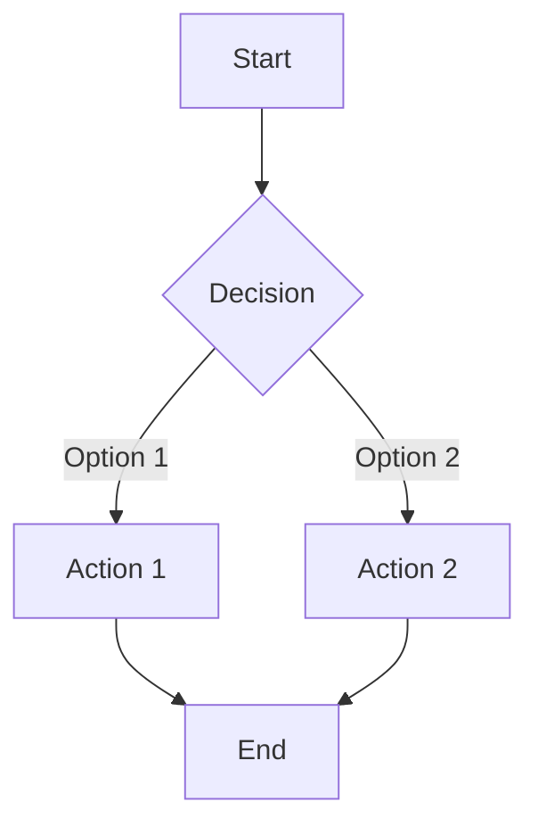

# [PRD] [Module] - [Feature Name]

## POC Map

| Role | Name |
|------|------|
| PM | [Name] |
| Designer | [Name] |
| FE | [Name] |
| BE/SA | [Name] |
| Data/Algo/AI | [Name] |
| QA | [Name] |
| Stakeholders | [Names] |

### Requirement Ticket (Xingyun)
[Link to Xingyun ticket]

---

## 1. Overview

### 1.1 Requirement Background, Objective, Benefit

**Background**: [Why are we doing this? What triggered this initiative?]

**Objective**: [What does success look like? Clear, measurable goal.]

**Benefit**: [Expected business/user benefit. Include data if available.]

### 1.1.1 Success Criteria

Key metrics to measure the success of this feature:

- [Metric 1] — TBC
- [Metric 2] — TBC
- [Metric 3] — TBC

### 1.2 Use Case

[Primary and secondary use cases. Describe the user scenario in concrete terms.]

### 1.3 Competitors Analysis

*To be completed by PM with verified data. Add competitor comparison here after research.*

### 1.4 User Analysis / Feedback

[User research data, feedback, analytics insights, or survey results that support this feature.]

### 1.6 Terminology (optional)

| Term | Definition |
|------|-----------|
| [Term] | [Definition] |

---

## 2. Overall Process

### 2.1 Flow / UML / System Chart

*Include user-journey diagrams that describe the customer experience. Do not include technical implementation diagrams — engineers will design those.*

#### User Flow

### 2.2 Relevant Systems & Domains/Parties

*List systems and domains involved, if known. Only include what has been confirmed — do not guess team structures or internal system names.*

---

## 3. Functional Requirement

### 3.1 Design

[Design references — Figma links, screenshots, wireframes. Include file key and node ID for Figma MCP access.]

### 3.2 Requirement List

**Highlights:**
1. [Key highlight / most important requirement]
2. [Second highlight]

| Epic/Requirement Module | User Stories / Requirement Details | Mockup | Remark | Priority |
|------------------------|-----------------------------------|--------|--------|----------|
| [Module] | As a [user], I want [action] so that [benefit]. [Detailed requirements.] | [Figma link] | [Notes] | P0/P1/P2 |

---

## 4. Non-functional Requirement

### 4.1 Multi-language

*Translations required for all supported locales (UK, DE, FR, NL). To be handled by the internal localisation team. Do not generate translations — just list the strings that need translating.*

Strings requiring translation:
- [String 1]
- [String 2]

### 4.2 Data / Event Tracker

*Describe what needs to be tracked and why. The PM will set up actual events in Easy Analytics.*

| What to track | When it fires | Why we need it |
|--------------|---------------|----------------|
| [Human-readable description] | [Trigger in plain English] | [What we learn from this] |

### 4.3 Feature Release Plan

#### V1 Scope

[What will be included in the first release. All platforms ship together unless otherwise specified.]

#### Future Iterations

- [Enhancement 1]
- [Enhancement 2]

---

## 5. Relevant User End

### Platform

| Platform | Involved |
|----------|----------|
| APP | [Yes/No] |
| PC | [Yes/No] |
| M (Mobile Web) | [Yes/No] |

### Adaptability

| Dark Mode | Fold Screen | Large Font Support | Disability Support |
|-----------|-------------|-------------------|-------------------|
| [Yes/No] | [Yes/No] | [Yes/No] | [Yes/No] |

---

## Open Questions

| Module | Question | Proposal | POC | Status |
|--------|----------|----------|-----|--------|
| [Module] | [Question] | [Proposed answer] | [Name] | Open/Resolved |

---

## Appendix

### A. Stakeholder Review Summary

[Summary of persona feedback and decisions made during review loops]

| Persona | Verdict | Key Feedback |
|---------|---------|--------------|
| Product Lead | [Verdict] | [Summary] |
| Engineer | [Verdict] | [Summary] |
| Designer | [Verdict] | [Summary] |
| Customer | [Verdict] | [Summary] |
| Stakeholder | [Verdict] | [Summary] |

### B. Conflicts Resolved

[Record of conflicts detected during review and how they were resolved]

| Conflict | Type | Resolution | Rationale |
|----------|------|-----------|-----------|
| [Description] | [Type] | [How resolved] | [Why this decision] |

### C. Future Enhancements

[Scope creep suggestions parked for future iterations]

- [Enhancement 1]
- [Enhancement 2]
